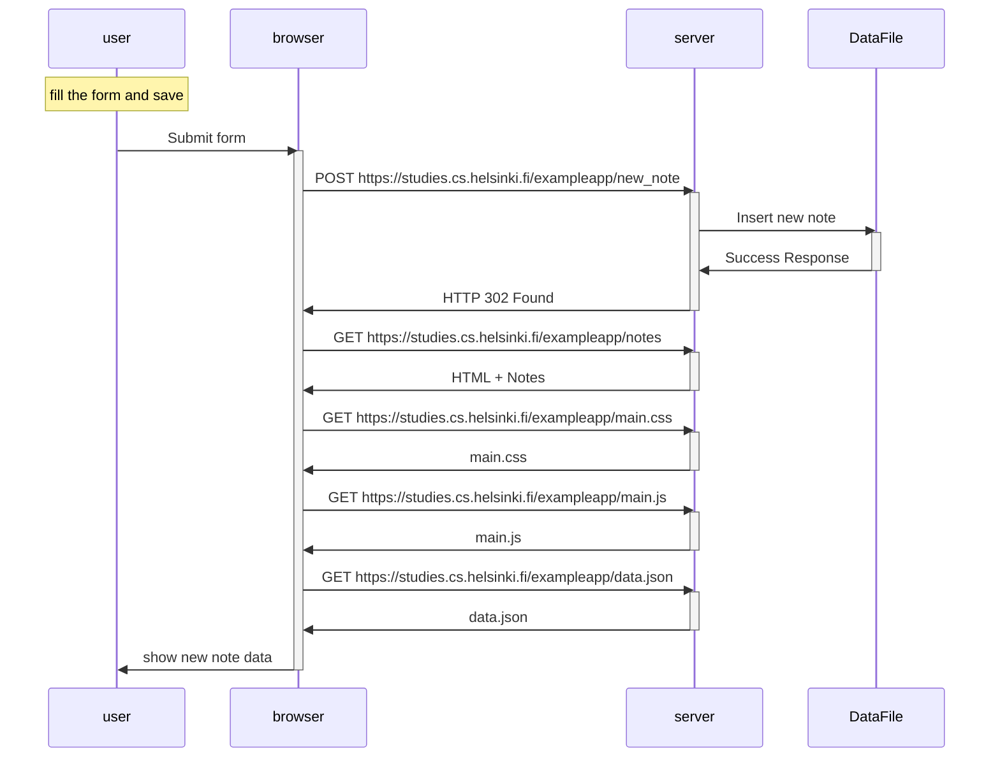

```mermaid
sequenceDiagram
  participant user
  participant browser
  participant server

  Note over user: fill the form and save

  user->>browser: Submit form
  activate browser

  browser->>server: POST https://studies.cs.helsinki.fi/exampleapp/new_note
  activate server
  server->>DataFile: Insert new note
  activate DataFile
  DataFile->>server: Success Response
  deactivate DataFile

  server->>browser: HTTP 302 Found
  deactivate server

  browser->>server: GET https://studies.cs.helsinki.fi/exampleapp/notes
  activate server
  server->>browser: HTML + Notes
  deactivate server

  browser->>server: GET https://studies.cs.helsinki.fi/exampleapp/main.css
  activate server
  server->>browser: main.css
  deactivate server

  browser->>server: GET https://studies.cs.helsinki.fi/exampleapp/main.js
  activate server
  server->>browser: main.js
  deactivate server

  browser->>server: GET https://studies.cs.helsinki.fi/exampleapp/data.json
  activate server
  server->>browser: data.json
  deactivate server

  browser->>user: show new note data
  deactivate browser
```
  
